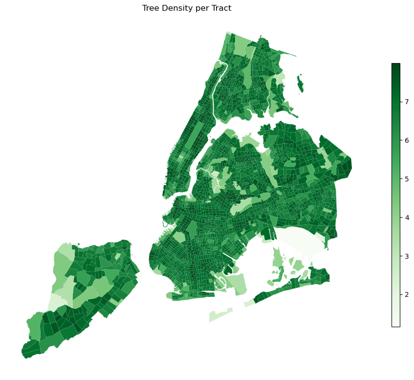
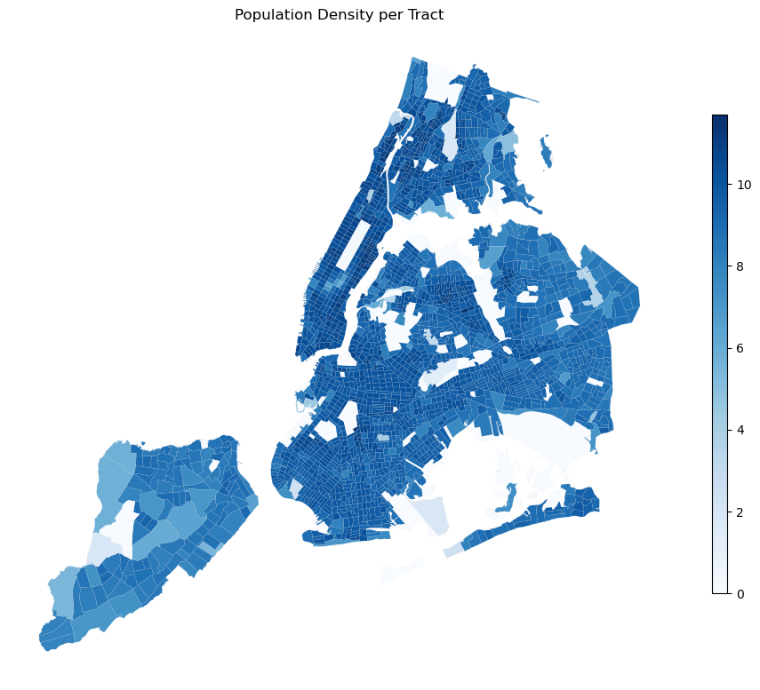
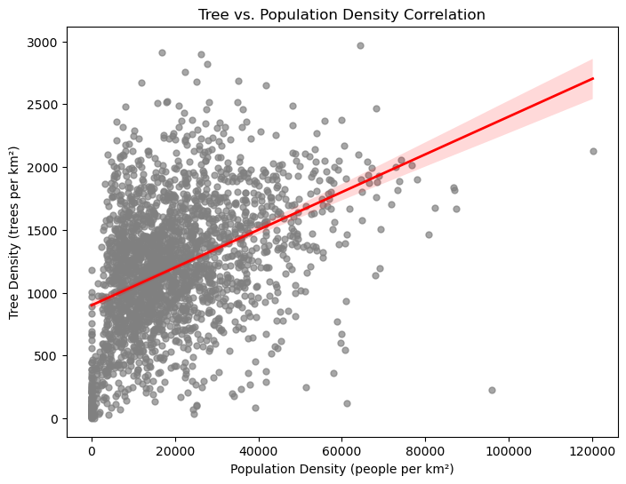
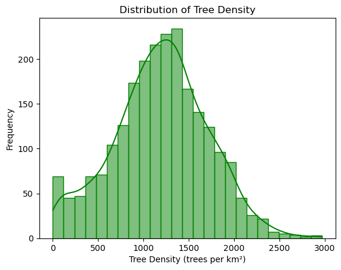
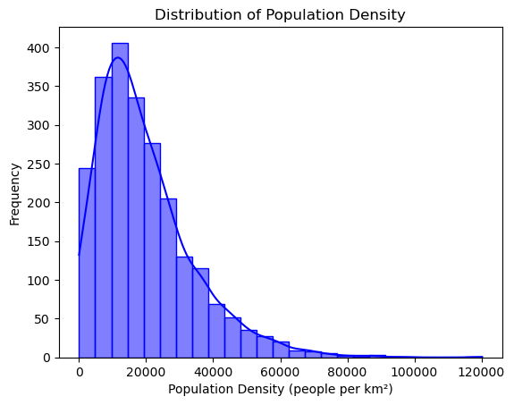
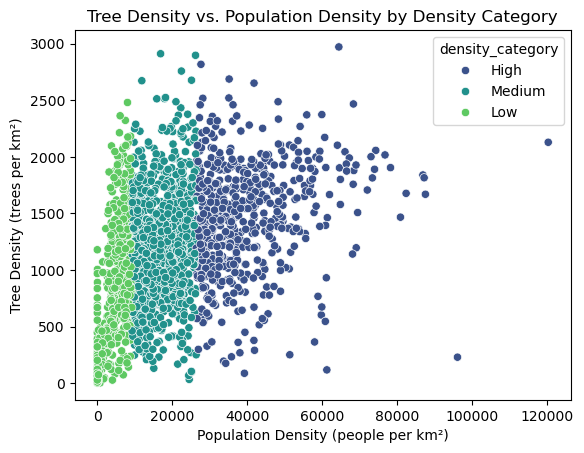

## Tree & Population Data Analysis of New York City

### Data source

https://datadryad.org/dataset/doi:10.5061/dryad.2jm63xsrf#methods (2022.08.30 version files)
License: CC0

### Tree density per tract

### Population density per tract

### Tree density & population density correlation

### Tree density distribution

### Population density distribution

### Tree density vs. Population density by density category
